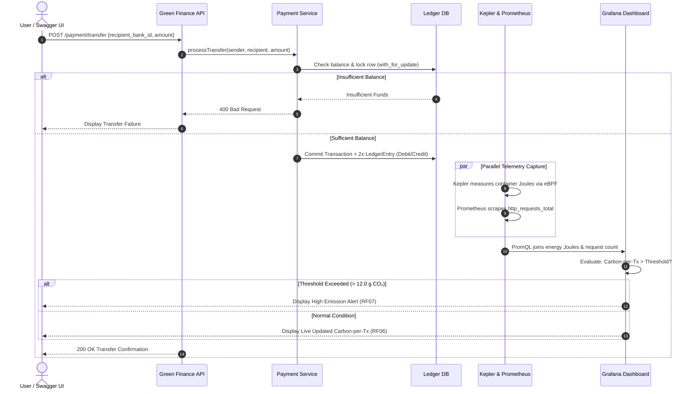

# 🌱 Green-Finance | Phase 2 Evaluation Presentation

**Project:** Green-Finance: A Real-Time Energy Observability Framework for Sustainable Financial Microservices  
**Course:** Software Engineering (TE Sem V) • **Institute:** S.P.I.T., Mumbai  
**Group:** 13  
**Team Members:**
- Soham Haridas Gaikwad (UID: 2024800030)
- Atharva Pramod Hule (UID: 2024800038)
- Laukik Vidyadhar Deshpande (UID: 2024800023)  
**Supervisor:** Prof. Kirti Chaudhari  

---

## Evaluation Rubrics Mapping (25 Marks Total)

| Component | Rubric Description | Marks | Addressed in Slides |
| :--- | :--- | :---: | :--- |
| **P1** | **Software Requirements Specification (SRS)** | **10** | Slide 2, Slide 3, Slide 4 |
| **P2** | **UML Diagrams** | **5** | Slide 5, Slide 6, Slide 7, Slide 8 |
| **P3** | **Design of Algorithm / Prototype** | **5** | Slide 9, Slide 10, Slide 11 |
| **P4** | **Presentation & Demonstration** | **5** | Slide 1, Slide 12 + Live Prototype Demo |

---

## Slide-by-Slide Detailed Presentation Content

```
================================================================================
SLIDE 1: TITLE SLIDE
================================================================================
```
### Slide Title:
# Green-Finance
### A Real-Time Energy Observability Framework for Sustainable Financial Microservices

#### Header / Context:
- **Course:** Software Engineering (TE Sem V) — Academic Year 2025–2026
- **Institute:** Bharatiya Vidya Bhavan's Sardar Patel Institute of Technology (S.P.I.T.), Mumbai
- **Evaluation:** Phase 2 Mini Project Evaluation (Total: 25 Marks)
- **Group:** 13

#### Presenters / Team:
- **Soham Haridas Gaikwad** (UID: 2024800030) — *Backend, Monitoring Stack (Prometheus/Grafana/Kepler) & DevOps*
- **Atharva Pramod Hule** (UID: 2024800038) — *Frontend Dashboard, System Documentation & Integration*
- **Laukik Vidyadhar Deshpande** (UID: 2024800023) — *Testing, Carbon-Factor Research & Comparative Analysis*

#### Project Supervisor:
- **Prof. Kirti Chaudhari**, Department of Computer Science & Engineering

> **Visual Note:** Clean white background, elegant Green-Finance leaf icon (`🌱`), S.P.I.T. college emblem top-left, professional typography.

---

```
================================================================================
SLIDE 2: PHASE 2 DELIVERABLES & EVALUATION ROADMAP
================================================================================
```
### Slide Title:
## Phase 2 Deliverables & Rubrics Alignment

#### Subtitle:
*Transitioning from Phase 1 Foundation to Formal Engineering Specification, Design & Prototype*

#### Visual 4-Grid Card Layout:

```
┌───────────────────────────────┐   ┌───────────────────────────────┐
│ P1: Software Requirements     │   │ P2: UML System Design         │
│ Specification [10 Marks]      │   │ [5 Marks]                     │
│ • Full IEEE 830-1998 standard │   │ • Structural & Behavioral     │
│ • 10 Functional Requirements  │   │ • Use Case, DFD L0/L1         │
│ • RNF01–RNF08 Non-Functional  │   │ • Class & Interaction Models  │
│ • 18-page formal document     │   │ • Strict OOP/DB constraints   │
└───────────────┬───────────────┘   └───────────────┬───────────────┘
                │                                   │
                ▼                                   ▼
┌───────────────────────────────┐   ┌───────────────────────────────┐
│ P3: Algorithm & Prototype     │   │ P4: Presentation & Live Demo  │
│ [5 Marks]                     │   │ [5 Marks]                     │
│ • PromQL Derivation Algorithm │   │ • Live Prototype on localhost │
│ • Marginal Energy Attribution │   │ • Simulated Bank Transfers    │
│ • High-Fidelity White-Theme UI│   │ • Grafana & PromQL Validation │
│ • 4 Grafana Panels + Swagger  │   │ • Traceability & Q&A Defense  │
└───────────────────────────────┘   └───────────────────────────────┘
```

#### Key Takeaways for Evaluators:
- **Phase 1 Recap (Already Defended):** Problem definition, motivation, literature survey, and initial scope.
- **Phase 2 Scope (Today's Evaluation):** Rigorous engineering specification (P1), multi-view UML modeling (P2), algorithmic derivation and working prototype execution (P3).
- **Core Engineering Pipeline:**
  $$\text{Requirements (SRS)} \longrightarrow \text{UML Blueprints} \longrightarrow \text{PromQL Algorithm} \longrightarrow \text{Interactive Prototype}$$

---

```
================================================================================
SLIDE 3: P1 — SOFTWARE REQUIREMENTS SPECIFICATION (SRS)
================================================================================
```
### Slide Title:
## P1: Software Requirements Specification (SRS)
#### Subtitle:
*Formal IEEE 830-1998 Compliant Specification (18 Pages Submitted Separately)*

#### Left Column — IEEE Specification Breakdown:
1. **Section 1: Introduction & Scope**
   - Self-contained energy observability framework for containerized banking workloads.
   - Decoupled simulated banking layer from telemetry to prevent measurement distortion.
2. **Section 2: Overall Description & Limitations**
   - 4-tier cooperating architecture; developer, evaluator, and auditor personas.
   - Hardware boundary: RAPL hardware counters vs. eBPF/ML power estimators.
3. **Section 3: Specific Requirements**
   - **Functional Requirements (RF01 – RF10):**
     - *RF01/RF02:* JWT Authentication & Simulated Payment Processing.
     - *RF03/RF04:* Kernel eBPF Telemetry & Prometheus Metric Scraping (15s interval).
     - *RF05/RF06:* Derived Carbon-per-Transaction & 4-Panel Grafana Visualization.
     - *RF07/RF08:* Threshold Alerts & Single-Command Containerized Deployment.
     - *RF09/RF10:* Historical Time-Range Queries & Externalized Environment Config.
   - **Non-Functional Requirements (RNF01 – RNF08):**
     - Usability, Documentation, Maintainability, Portability, Performance (<2s API SLA), Reliability, Availability, Security.

#### Right Column — Key Engineering Metrics & Transition:
- **Document Status:** Complete 18-page formal IEEE document compiled and archived in `Documents/Green Finanace SRS.docs.pdf`.
- **Requirements-to-Design Mapping:**
  ```text
  [RF01, RF02] ──► Banking Microservices (FastAPI + SQLite/Postgres)
  [RF03, RF04] ──► Monitoring Stack (Kepler eBPF + Prometheus :9090)
  [RF05, RF06] ──► Analytical Observability (PromQL + Grafana :3000)
  [RF07, RF10] ──► ESG Thresholds & Config (Alertmanager + .env)
  ```

---

```
================================================================================
SLIDE 4: SYSTEM ARCHITECTURE & OBSERVABILITY PIPELINE
================================================================================
```
### Slide Title:
## System Architecture & End-to-End Observability Pipeline
#### Subtitle:
*Hardware-to-Application Correlation for Financial Microservices*

```
       [ Client / Swagger UI / User ]
                      │ HTTP POST /payment/transfer {Sender, Recipient Bank ID, Amount}
                      ▼
 ┌─────────────────────────────────────────────────────────┐
 │             SIMULATED BANKING MICROSERVICES             │
 │  • auth-service: JWT Token Validation                   │
 │  • payment-service: Atomic Double-Entry Ledger Engine   │
 └────────────────────────────┬────────────────────────────┘
                              │ Containerized Execution (Docker Compose)
                              ▼
 ┌─────────────────────────────────────────────────────────┐
 │               ENERGY TELEMETRY LAYER                    │
 │  • Kepler (eBPF Probes): Reads CPU RAPL / Hardware      │
 │  • Metric Export: kepler_container_joules_total         │
 └────────────────────────────┬────────────────────────────┘
                              │ Scraped every 15s (/metrics)
                              ▼
 ┌─────────────────────────────────────────────────────────┐
 │               METRICS AGGREGATION LAYER                 │
 │  • Prometheus (:9090): Stores Time-Series Counters      │
 │  • Tracks: http_requests_total, latency, container J    │
 └────────────────────────────┬────────────────────────────┘
                              │ PromQL Mathematical Join
                              ▼
 ┌─────────────────────────────────────────────────────────┐
 │               VISUALIZATION & ESG AUDITING              │
 │  • Grafana (:3000): Carbon-per-Tx, Energy Hotspots      │
 │  • Alerts: Automated visual warning when > 12.0 g CO₂   │
 └─────────────────────────────────────────────────────────┘
```

#### Architectural Design Rationales:
1. **Sidecar / Non-Intrusive Telemetry:** Kepler operates at the Linux kernel level via eBPF probes; the banking microservices require zero code alteration to measure electricity consumption.
2. **Atomic Ledger Preservation:** Every financial request executes a strict double-entry balance check ($\text{Debit} = \text{Credit}$) before telemetry is stamped.

---

```
================================================================================
SLIDE 5: P2 — UML DESIGN SUITE OVERVIEW
================================================================================
```
### Slide Title:
## P2: UML Diagrams — Structural & Behavioral Modeling
#### Subtitle:
*Object-Oriented Analysis and Design (OOAD) Blueprints for System Engineering*

#### Summary of UML Artifacts Created:
```
┌─────────────────────────────────────────┬─────────────────────────────────────────┐
│           STRUCTURAL MODELS             │            BEHAVIORAL MODELS            │
├─────────────────────────────────────────┼─────────────────────────────────────────┤
│ • UML Class Diagram (SE Experiment 3)   │ • UML Use Case Diagram                  │
│   Complete entity relationship,         │   Actor personas, boundaries, and goals │
│   attributes, methods & multiplicities  │ • UML Sequence Diagram (SE Exp 4)       │
│                                         │   Chronological message flow & alt-frame│
│ • Component & Deployment Diagrams       │ • UML Activity Diagram (SE Exp 5)       │
│   Docker container orchestration, ports │   Swimlanes: API, Service, eBPF, Grafana│
│   and physical process mapping          │ • Data Flow Diagrams (Level 0 & 1 DFD)  │
└─────────────────────────────────────────┴─────────────────────────────────────────┘
```

#### Key Design Highlights:
- **Clean Separation of Concerns:** Boundary Objects (FastAPI Endpoints), Control Objects (Services/Ledger Engine), Entity Objects (SQLAlchemy ORM), and Monitoring Probes (Kepler/Prometheus).
- **Formal Verification:** All UML diagrams reviewed and verified against IEEE SRS functional requirements.

---

```
================================================================================
SLIDE 6: BEHAVIORAL UML — USE CASE DIAGRAM & CONTEXT DFD
================================================================================
```
### Slide Title:
## Behavioral UML: Use Case Diagram & Data Flow (DFD L0/L1)
#### Subtitle:
*Modeling User Roles, System Boundaries, and Functional Information Exchanges*

#### Core Actors & System Boundary:
- **Actors:**
  - `Bank Customer / User`: Logs in, issues money transfers using Bank IDs (`HDFC9999`, `MAH123`, `IDF892`).
  - `Developer / Test Engineer`: Generates synthetic workloads via Swagger UI, validates PromQL queries.
  - `Sustainability Auditor / Evaluator`: Inspects Grafana dashboards, analyzes energy hotspots, checks double-entry ledger.

#### Functional Flow (Level 0 Context Diagram):
```text
[Bank User / Swagger] ──(1) Credentials & Transfer Request──► [ Eco-Monitor / Green-Finance ]
                      ◄──(2) JWT Token & Balance Confirmation─ [    System Boundary    ]
                                                                      │ (3) Prometheus Scrape
                                                                      ▼
                                                               [ Prometheus Engine ]
                                                                      │ (4) PromQL Metric Join
                                                                      ▼
[Auditor / Evaluator] ◄──(5) Live Grafana Carbon Dashboard ──── [ Grafana Dashboard ]
```

#### Key Use Cases Identified:
1. **UC-01:** Authenticate via JWT & Obtain Session Claims.
2. **UC-02:** Execute Controlled Inter-Bank Transfer (with custom amount & Bank IDs).
3. **UC-03:** Attribute Container Energy Draw (Kepler eBPF probe).
4. **UC-04:** Compute Derived Carbon-per-Transaction Metric (PromQL).
5. **UC-05:** Visualize Service Energy Hotspots & Receive Threshold Spike Alerts (RF07).

---

```
================================================================================
SLIDE 7: STRUCTURAL UML — CLASS DIAGRAM & DOMAIN ENTITIES
================================================================================
```
### Slide Title:
## Structural UML: Class Diagram & Domain Entities
#### Subtitle:
*Object-Oriented Design Blueprint (SE Lab Experiment 3)*

```
 ┌───────────────────────┐          1 : 1          ┌────────────────────────┐
 │         User          │ ───────────────────────►│        Account         │
 ├───────────────────────┤ Composition             ├────────────────────────┤
 │ - id: String(36) [PK] │ (Account deleted with   │ - id: String(36) [PK]  │
 │ - username: String(50)│  User)                  │ - user_id: String(36)  │
 │ - bank_id: String(20) │                         │ - name: String(50)     │
 │ - hashed_password: str│                         │ - balance: Float       │
 └──────────┬────────────┘                         │ * chk_positive_balance │
            │ 1 : *                                └───────────▲────────────┘
            │ Association                                      │ 1 : *
            ▼                                                  │ Referenced
 ┌───────────────────────┐          1 : 2..*       ┌───────────┴────────────┐
 │      Transaction      │ ───────────────────────►│      LedgerEntry       │
 ├───────────────────────┤ Composition             ├────────────────────────┤
 │ - id: String(36) [PK] │ (Transaction requires   │ - id: String(36) [PK]  │
 │ - description: String │  >=1 Debit and 1 Credit)│ - transaction_id [FK]  │
 │ - created_at: DateTime│                         │ - account_id [FK]      │
 └───────────────────────┘                         │ - type: "debit"|"credit│
                                                   │ - amount: Float        │
                                                   │ - running_balance: Fl  │
                                                   └────────────────────────┘
```

#### Core OOAD Relationships & Architectural Constraints:
1. **User $\longleftrightarrow$ Account (Composition $1:1$):** A financial account cannot exist without a verified user entity.
2. **Transaction $\longleftrightarrow$ LedgerEntry (Composition $1:2..*$):** Every financial transaction strictly instantiates at least one `debit` entry and one `credit` entry atomically.
3. **SQL Integrity Guard:** `CheckConstraint("balance >= 0")` prevents negative balances at the database engine level.

---

```
================================================================================
SLIDE 8: BEHAVIORAL UML — SEQUENCE & ACTIVITY DIAGRAMS
================================================================================
```
### Slide Title:
## Behavioral UML: Sequence & Activity Diagrams
#### Subtitle:
*Chronological Interaction & Concurrent Telemetry Tracking (SE Experiments 4 & 5)*

#### Sequence Workflow (Message Passing & Alt Fragments):


#### Key Elements Modeled:
- **Combined Fragments:** `alt` frame isolates success vs. failure; `par` fork node models concurrent hardware telemetry scraping alongside database commits.

---

```
================================================================================
SLIDE 9: P3 — DESIGN OF ALGORITHM & RESEARCH COMPARISON
================================================================================
```
### Slide Title:
## P3: Design of Algorithm & Mathematical Derivation
#### Subtitle:
*Normalizing Infrastructure Energy Consumption into a Granular Financial Transaction Metric*

#### 1. Core Mathematical Formula:
$$\text{Carbon-per-Transaction (g CO}_2/\text{tx)} = \frac{\sum \text{rate}(\text{kepler\_container\_joules\_total}[1m]) \times F_{\text{grid}}}{\sum \text{rate}(\text{http\_requests\_total}[1m])}$$

Where:
- $\text{kepler\_container\_joules\_total}$: Cumulative container energy in Joules attributed via kernel eBPF probes.
- $\text{rate}(\dots)[1m]$: Per-second energy rate (Watts = Joules/sec).
- $F_{\text{grid}}$: Regional grid carbon intensity ($0.38 \text{ kg CO}_2/\text{kWh} = 0.0001055 \text{ g CO}_2/\text{Joule}$).
- $\text{http\_requests\_total}$: Transaction denominator incremented by FastAPI metrics client.

#### 2. Research Comparison & Benchmark Matrix (From Project Research Analysis):
| Capability / Dimension | GreenFrame (Marmelab) | Cloud Carbon Footprint | Kepler / Scaphandre | Green-Finance (Our System) |
| :--- | :---: | :---: | :---: | :---: |
| **Energy Telemetry** | Scenario-based | Billing / Modeled | Kernel eBPF / RAPL | 🟩 **Kernel eBPF Telemetry** |
| **Financial Workload Focus** | ❌ (Generic Web) | ❌ (Cloud Accounts) | ❌ (Raw Containers) | 🟩 **Simulated Banking Services** |
| **Transaction Counter Denominator** | ❌ None | ❌ None | ❌ None | 🟩 **Built-in Transaction Normalizer** |
| **Live Carbon-per-Transaction** | ❌ Offline only | ❌ Offline Billing | ❌ Raw Watts only | 🟩 **Real-Time PromQL Metric** |
| **Double-Entry Ledger Audit** | ❌ None | ❌ None | ❌ None | 🟩 **Atomic Balance Sheet Proof** |

---

```
================================================================================
SLIDE 10: P3 — SYSTEM DESIGN & OPERATIONAL WORKFLOW
================================================================================
```
### Slide Title:
## P3: Operational Workflow — From API Call to Metric Dashboard
#### Subtitle:
*The 6-Stage Lifecycle of a Sustainable Financial Transaction*

```text
┌─────────────────────────────────────────────────────────────────────────────┐
│  STAGE 1: TRANSACTION INITIATION                                            │
│  User authenticates (JWT) & triggers transfer via Swagger UI / Dashboard.   │
│  Specifies Sender Bank ID (HDFC9999), Recipient (MAH123), Amount (₹ INR).   │
└──────────────────────────────────────┬──────────────────────────────────────┘
                                       ▼
┌─────────────────────────────────────────────────────────────────────────────┐
│  STAGE 2: ATOMIC DATABASE BOOKKEEPING                                       │
│  FastAPI payment-service executes double-entry journal entries.             │
│  Debit Sender Cash Wallet (-₹) | Credit Recipient Cash Wallet (+₹).        │
└──────────────────────────────────────┬──────────────────────────────────────┘
                                       ▼
┌─────────────────────────────────────────────────────────────────────────────┐
│  STAGE 3: KERNEL-LEVEL TELEMETRY ATTRIBUTION                                │
│  Kepler tracks CPU cycles, cache misses, and RAPL energy consumed by        │
│  the payment-service container during request execution.                    │
└──────────────────────────────────────┬──────────────────────────────────────┘
                                       ▼
┌─────────────────────────────────────────────────────────────────────────────┐
│  STAGE 4: PROMETHEUS METRIC AGGREGATION                                     │
│  Prometheus pulls /metrics every 15s, recording container Joules and        │
│  http_requests_total counter.                                               │
└──────────────────────────────────────┬──────────────────────────────────────┘
                                       ▼
┌─────────────────────────────────────────────────────────────────────────────┐
│  STAGE 5: PROMQL DERIVATION & ESG CONVERSION                                │
│  Telemetry service joins energy Watts & throughput, applying grid factor    │
│  (0.38 kg CO₂/kWh) to derive grams of CO₂ emitted per transfer.             │
└──────────────────────────────────────┬──────────────────────────────────────┘
                                       ▼
┌─────────────────────────────────────────────────────────────────────────────┐
│  STAGE 6: GRAFANA VISUALIZATION & ALERT DISPATCH                            │
│  Live 4-panel dashboard updates. If emissions > 12.0 g CO₂, visual RF07     │
│  alert banner is automatically raised.                                      │
└─────────────────────────────────────────────────────────────────────────────┘
```

---

```
================================================================================
SLIDE 11: P3 — PROTOTYPE DEMONSTRATION & DASHBOARD PANELS
================================================================================
```
### Slide Title:
## P3: Prototype — Green-Finance Observability Dashboard
#### Subtitle:
*High-Fidelity White-Theme Single-Page Dashboard Deployed on localhost:8085*

#### 6 Core Prototype Modules Implemented:
1. **Executive KPI Stat Bar:**
   - Real-time Carbon-per-Tx ($8.42\text{ g CO}_2/\text{tx}$), Active Power ($118.6\text{ W}$), Total Volume ($1,429\text{ Tx}$), Cumulative Footprint ($12.03\text{ kg CO}_2$).
2. **Interactive Swagger UI Simulator:**
   - Controlled Bank Transfer form with live Bank ID dropdowns (`HDFC9999` $\rightarrow$ `MAH123`, `IDF892`, `SBIN456`).
   - OpenAPI interactive explorer testing `/auth/login`, `/payment/transfer`, `/telemetry/realtime`, `/metrics`.
3. **4-Panel Grafana Observability Grid (RF06):**
   - *Panel 1:* Carbon-per-Transaction time series with dynamic safety baseline.
   - *Panel 2:* Container Power Allocation (`payment-service` 68.4% vs `auth-service` 31.6%).
   - *Panel 3:* Request throughput & P99 latency SLA verification ($46\text{ ms} < 2000\text{ ms}$).
   - *Panel 4:* Service Energy Hotspot Ranking table with ESG ratings.
4. **Interactive PromQL Query Engine:**
   - Pre-configured queries from IEEE SRS with instant line chart rendering and raw vector JSON response.
5. **Double-Entry Financial & Carbon Ledger:**
   - Real-time ledger entries displaying $\text{DR} = \text{CR}$ proof, Joules consumed, and CSV export.
6. **Automated Alerting Banner (RF07):**
   - Immediate warning banner raised when transactions exceed the configurable $12.0\text{ g CO}_2$ threshold.

> **Localhost Access:** Hosted locally at `http://localhost:8085` via `python -m http.server 8085 --directory "prototype layout"`.

---

```
================================================================================
SLIDE 12: PROTOTYPE USER FLOW & CONCLUSION
================================================================================
```
### Slide Title:
## Prototype User Flow & Phase 2 Conclusion
#### Subtitle:
*Summary of Achievements Against Evaluation Rubrics & Phase 3 Roadmap*

#### End-to-End User Experience Flow:
$$\text{Login (JWT / Bank ID)} \longrightarrow \text{Initiate Transfer (₹)} \longrightarrow \text{Kepler eBPF Sense} \longrightarrow \text{PromQL Calculate} \longrightarrow \text{Grafana Audit}$$

#### Phase 2 Evaluation Rubric Scorecard:
- ✅ **P1 — SRS (10 Marks):** Complete 18-page IEEE 830-1998 compliant specification detailing RF01–RF10, RNF01–RNF08, and interface requirements.
- ✅ **P2 — UML Design (5 Marks):** Full OOAD model suite including Use Case, DFD (L0/L1), Class, Sequence, and Activity diagrams with strict mathematical/accounting constraints.
- ✅ **P3 — Algorithm & Prototype (5 Marks):** Formal PromQL mathematical derivation combining Kepler kernel energy with transaction throughput, demonstrated on a fully interactive white-theme prototype.
- ✅ **P4 — Presentation & Defense (5 Marks):** Structured presentation connecting engineering specifications directly to running software on localhost.

#### Phase 3 Next Steps (Roadmap):
1. Bare-metal Linux deployment to interface physical Intel/AMD RAPL hardware registers directly with Kepler.
2. Locust/K6 automated transaction load generation to profile high-concurrency energy inflection points.
3. Automated CI/CD pipeline blocking pull requests that introduce energy-inefficient hotspot code.

---

### Closing Slide Text:
## Thank You!
### Questions & Answers
**Repository:** [https://github.com/soham-092510/Green-Finance/tree/layout](https://github.com/soham-092510/Green-Finance/tree/layout)  
**Prototype URL:** [http://localhost:8085](http://localhost:8085)  
**Group 13** • Department of Computer Science & Engineering • S.P.I.T.
